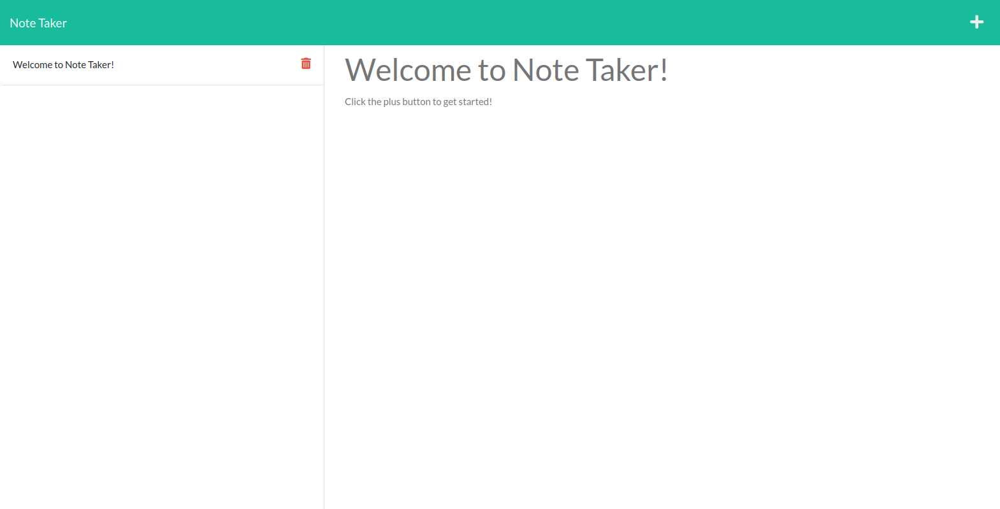

# Note Taker

## Description

https://antced-note-taker.herokuapp.com/

This app allows you to keep track of various notes with the ability to add new ones, or delete old ones.

## Installation

No installation needed, just visit [the heroku app.](https://antced-note-taker.herokuapp.com/)
  
## Usage
  
Click the plus button to add a new note, then click the save button after entering a title and text. Click the delete button to remove unwanted notes from the left panel.

## Credits

Worked on as a project for UPENN's coding bootcamp under the instruction of Leif Hetland

## Questions

https://github.com/antced
